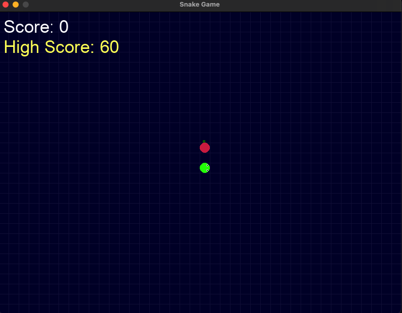

# PySnake Game

A modern implementation of the classic Snake game using Pygame with enhanced visual features and high score tracking.



## Features

- Smooth snake movement with rounded segments
- Realistic snake head with directional eyes
- Apple-style food items
- Grid-based background with dark theme
- Score and high score tracking
- Persistent high score saving

## Requirements

```python
pygame>=2.0.0
```

## Installation

1. Clone this repository:
```bash
git clone https://github.com/yourusername/pysnake.git
cd pysnake
```

2. Install dependencies:
```bash
pip install pygame
```

## How to Play

Run the game:
```bash
python snake.py
```

### Controls
- Use arrow keys to control the snake's direction
- Eat the red apples to grow and increase your score
- Avoid hitting the walls or the snake's body
- Press 'Q' to quit when game is over
- Press 'C' to play again after game over

## Game Features

- **Visual Improvements**:
  - Rounded snake segments with scale effects
  - Animated snake head with directional eyes
  - Apple-styled food items
  - Dark theme with grid background

- **Scoring System**:
  - Current score display
  - High score tracking
  - Persistent high score storage in JSON format

## File Structure

```
├── snake.py          # Main game file
└── high_score.json   # High score storage
```
